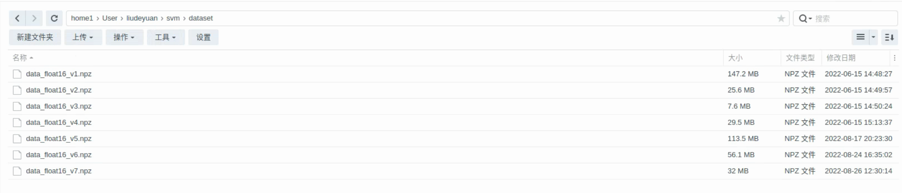
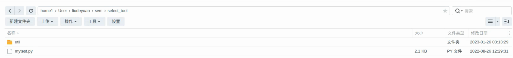

Dataset
=======

下载之前的数据集
----------------

我们首先下载之前的一些数据集，放到SVM仓库的dataset路径，这些数据集需要根据需要和新的数据集一起进行训练，具体nas路径如上图所示。

分类图片
--------------

芦苇给我们新的数据集之后，我们需要对数据集进行分类，把图卡类型的分到文件夹1，非图卡类型的分到文件夹0，我写了一个脚本来快速完成这个步骤，具体的代码nas路径如上图所示。

指定文件夹
--------------

分类好图片之后，我们需要对生成训练数据集的脚本做一点修改，因为我们存放新数据集的路径是不一样的。

.. code-block:: shell

    data_dir = {
        0: '/home/SENSETIME/liudeyuan1/Desktop/2TB/oppo_result_0824/0', 
        1: '/home/SENSETIME/liudeyuan1/Desktop/2TB/oppo_result_0824/1',   
    }

我们首先修改dataloader.py，将0对应的文件夹路径改成非图卡类数据的文件夹路径，将1对应的文件夹路径改成图卡类数据的文件夹路径

.. code-block:: shell

    np.savez('dataset/data_float16_v7.npz', X_train=X_train, X_test=X_test, y_train=y_train, y_test=y_test)

然后，我们修改data2npy.py，修改数据集保存路径，由于之前总共有7批数据，所以当前的路径是'dataset/data_float16_v7.npz'，如果有一批新的
数据，我们可以改成'dataset/data_float16_v8.npz'。

生成训练数据集
--------------

.. code-block:: shell

    python data2npy.py

之后我们只要运行data2npy.py脚本，就会生成新的训练数据集，存放到对应指定路径。