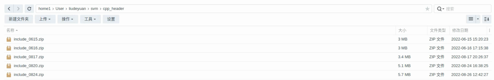

C++ Header
==========

生成C++头文件
-------------------

.. code-block:: shell

    mkdir build
    cd build
    cmake ..
    make
    ./bin_to_cpp_header

可以直接用vscode的cmake扩展编译，也可按照上述代码编译，之后运行编译出来的结果，就会将之前保存下来的SVM模型参数转化为对应的C++头文件，并保存在model/include文件夹中。

上传到NAS
-------------------

将保存C++头文件的include文件夹压缩为zip文件，并加上日期后缀，并上传到nas上，路径如上图所示，上图的zip文件是之前的一些训练结果，最后将nas路径发给芦苇即可。